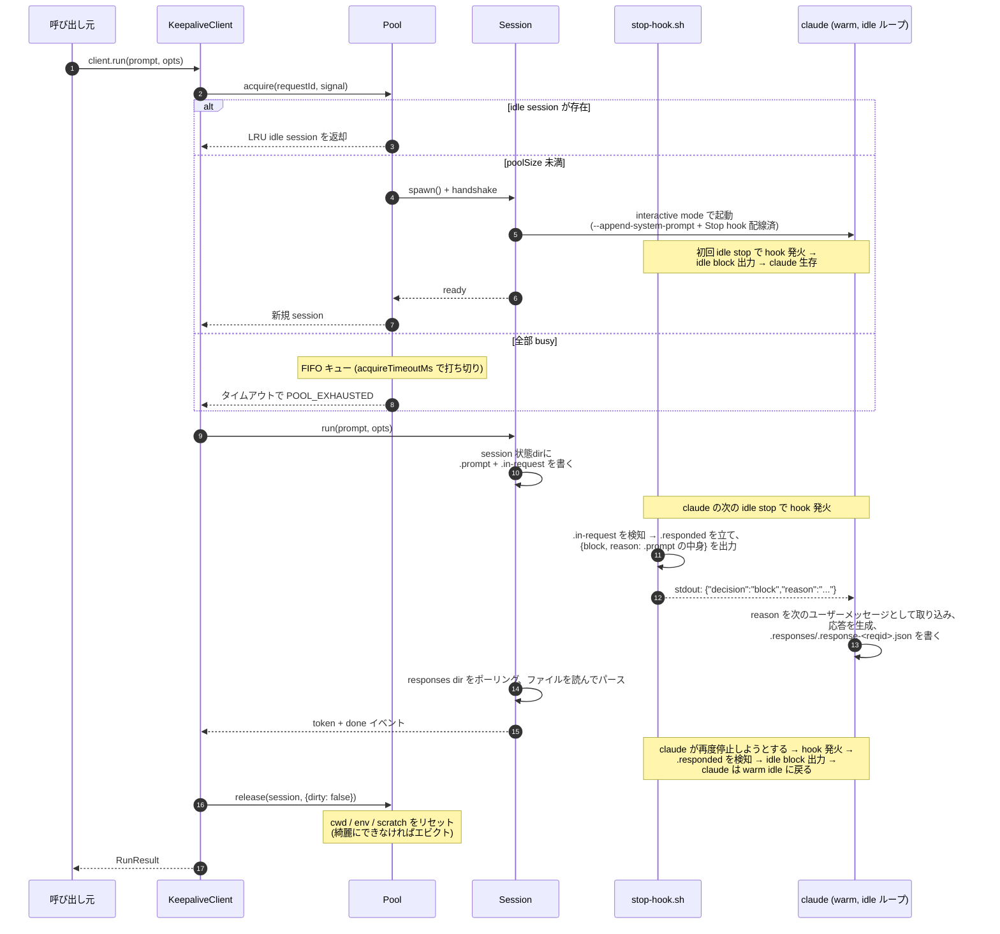
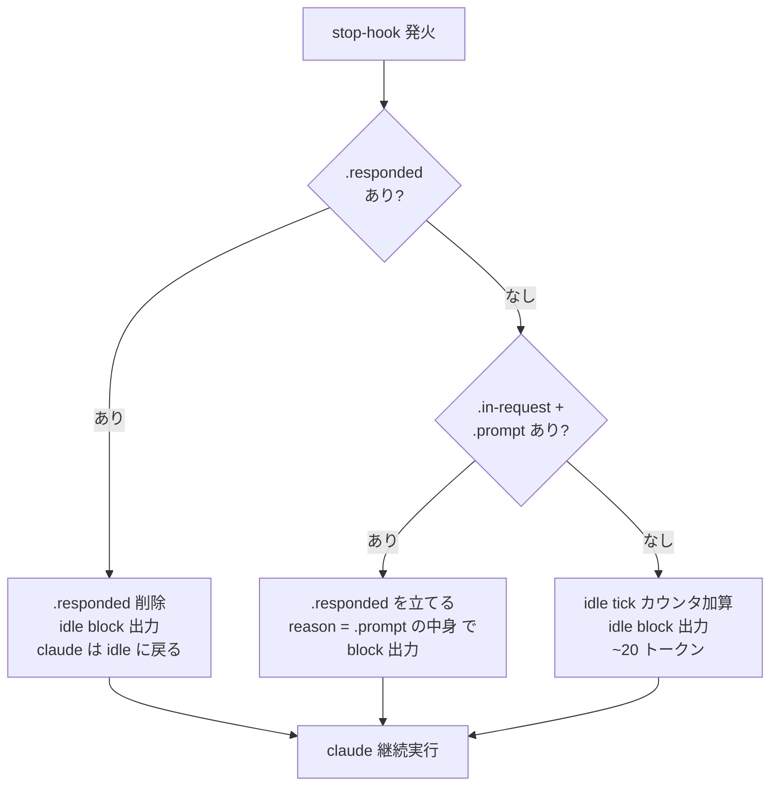

# claude-keepalive

> `claude -p` のドロップイン置換ライブラリ。warm な `claude` プロセスを使い回して cold-start を消す — リクエスト間で状態を漏らさずに。

[English README](./README.md)

`claude -p "..."` は呼び出すたびにプロセス起動コストを丸ごと払います（モダンな Mac で ~5〜10秒）。1時間に数百回 Claude を呼ぶタスクランナーでは、この cold-start が壁時計時間の大半を占めます。

`claude-keepalive` は少数の `claude` プロセスを interactive mode で warm に保ち、stop-hook 注入チャネル経由で各リクエストをルーティングします — `claude -p` と同じインターフェース、リクエスト単位の隔離は保ったまま、cold-start は warm session につき1回だけ払えば済みます。

---

## ステータス

**v0.x — 早期開発中。** Interactive warm-keepalive 経路は end-to-end で配線され、実 `claude` CLI で検証済み。`pnpm smoke:warm` および `examples/test-service` + `pnpm bench` でレイテンシ測定可能。v0.1.4 で `prewarm()` + `warmupPrompt` を追加し、起動時に warm session を事前準備できるようになった（lazy spawn 比 p50 −27〜35%）。Fresh-conversation 契約（invariant #1）は system-prompt 制約 + `maxRequestsPerSession` 制限で担保し、`pnpm smoke:leakage` と `test/e2e/warm.test.ts` を回帰ゲートとしている。3層テスト構成（unit / integration / e2e）稼働中。残作業 — `mode: 'print'` 配線、idle-tick latency 削減、Pool spawn race 修正 — は `TODO.md` で追跡。

---

## 仕組み

interactive mode の `claude` は「停止」レスポンスを生成すると終了します。**stop hook** はその停止をブロックできて、stdout に以下の構造化 JSON を1行書くことで実現します：

```json
{"decision":"block","reason":"<次のユーザーメッセージとして注入されるテキスト>"}
```

これを見た claude は停止せず、`reason` を **次のユーザーメッセージ** として取り込んで応答を生成します。つまり stop hook は **session driver が idle keepalive tick と実ユーザープロンプトの両方を注入するチャネル** であり、stdin への書き込みは一切発生しません。

これを利用してプール 1スロットにつき 1本の warm プロセスを保持します：

- プールに作業がないとき → hook が小さな idle センチネル（~20 トークン）を出力 → claude は idle に戻る
- リクエストが到着したとき → driver がフラグファイルにプロンプトを書く → 次の stop-hook 発火がそれを読んで `reason` として出力 → agent がターンを実行し、spawn 時に `--append-system-prompt` で注入された契約に従って `.responses/` 配下のリクエスト別ファイルに返答を書く
- framing 層がその応答ファイルをポーリングし、パースして呼び出し元に結果を渡す

### アーキテクチャ（3層）

```
┌──────────────────────────────────────────────────────────────────────────┐
│                                                                          │
│   呼び出し元 ──run(prompt, opts)──▶  ┌────────┐                          │
│                                      │  Pool  │  warm session を選ぶ     │
│                                      └───┬────┘                          │
│                                          │ acquire                       │
│                                          ▼                               │
│                                  ┌──────────────┐                        │
│                                  │   Session    │ 1本の warm claude       │
│                                  └──────┬───────┘                        │
│                                         │ (session状態dir経由の          │
│                                         │  ファイルベースプロトコル、    │
│                                         │  stdin 注入はしない)            │
│                                         ▼                                │
│                                  ┌──────────────┐                        │
│                                  │   claude     │ interactive mode、     │
│                                  │              │ blocking Stop hook で  │
│                                  │              │ 生存維持               │
│                                  └──────────────┘                        │
│                                                                          │
└──────────────────────────────────────────────────────────────────────────┘
```

| 層          | 責務                                              | 知らないこと                       |
| ----------- | ------------------------------------------------- | ---------------------------------- |
| **api**     | 公開リクエスト/レスポンス契約                     | pool の内部、プロセス spawn        |
| **pool**    | session 選択・エビクション・サイジング・隔離      | プロンプト内容、ストリーム framing |
| **session** | 1本の warm `claude` プロセス + stop-hook トリック  | 他の session、リクエストルーティング |

### Session 状態ディレクトリ

各 warm session は `runtime/sessions/<session-id>/` 配下に1つのディレクトリを持ちます：

```
runtime/sessions/<session-id>/
  .claude/settings.json     Stop hook を ./stop-hook.sh に bind
  stop-hook.sh              claude が Stop ごとに呼ぶ bash スクリプト
  .prompt                   存在 = 次に注入する実プロンプトが queued
  .in-request               フラグ：実リクエストが進行中
  .responded                フラグ：直前の hook 発火が実プロンプトを注入した
  .responses/               agent が応答をここに書く（リクエスト毎に1ファイル）
    .response-<requestId>.json
  .last-tick                直近の idle hook 発火の epoch ms
```

このディレクトリ **が** driver と動作中 claude の間のプロトコル。spawn 後 driver は claude の stdin に何も書きません。

### リクエストフロー



### Stop-hook の分岐ロジック

hook は小さな bash スクリプトです。発火ごとに **必ず 1行の block JSON を出力する必要があります**（さもないと claude は停止してしまう）。分岐：



どの経路でも `{decision:"block", ...}` を出力。プロセスが終了するのは pool が evict（SIGTERM）したときだけ。

### なぜ TTY が *不要* なのか

素朴な smoke (`claude --dangerously-skip-permissions "..." < /dev/null > out.txt`) は ~10秒で終了するので「claude は実 pty を要求する」と誤解しがちですが、これは **Stop hook が設定されていない場合のみ** 真です。実測ルール：

| stdio          | `.claude/settings.json` に Stop hook? | 挙動                                   |
| -------------- | ------------------------------------- | -------------------------------------- |
| 非TTY          | なし                                  | プロンプトを処理して exit (`-p` 相当)  |
| 非TTY          | **あり (blocking)**                   | **idle ループに留まる、hook が発火**   |
| TTY            | どちらでも                            | idle ループに留まる                    |

このライブラリは session ごとに `.claude/settings.json` を書き、`cwd = <sessionDir>` で claude を起動するので、claude は我々の hook 設定を読み込みます。これにより `WarmSession` は素の `stdio: ['pipe','pipe','pipe']` で動作し、**`node-pty` は依存に不要**。`pnpm smoke:warm` で検証済み。

---

## インストール

```bash
pnpm add claude-keepalive
```

Node.js ≥ 22 と、PATH 上の `claude` CLI が必要です。

---

## 使い方

### 同期スタイル

```ts
import { createClient } from 'claude-keepalive';

const client = createClient({
  poolSize: 4,
  defaultTimeoutMs: 5 * 60_000,
});

const result = await client.run('HEAD~1..HEAD の diff を要約して', {
  cwd: '/path/to/repo',
  allowedTools: ['Read', 'Bash'],
  requestId: 'task-1234',
});

console.log(result.text);

process.on('SIGTERM', () => client.close());
```

### ストリーミング

```ts
for await (const ev of client.runStream(prompt, opts)) {
  switch (ev.type) {
    case 'token': process.stdout.write(ev.text); break;
    case 'done':  return ev.result;
    case 'error': throw new Error(`${ev.error.code}: ${ev.error.message}`);
  }
}
```

`token` イベントの粒度はモードによって異なります（下表参照）。

### プールの事前ウォーミング

デフォルトでは Pool は lazy（最初のリクエストが来てから session を spawn）です。サービス起動直後の **最初のリクエストを速くしたい**、または **バーストが来る前に準備しておきたい** 場合は、`prewarm()` で `poolSize` 個の session を事前に立ち上げて idle ループに入れておけます：

```ts
const client = createClient({
  poolSize: 4,
  // オプション: warmupPrompt を渡すと、各 warm session でこのプロンプトを
  // 1回流して結果を捨てる。実ワークロードと共通する prefix を含めると、
  // Anthropic 側の prompt cache も同時に温まる。
  warmupPrompt: 'Acknowledge that you are ready.',
});

await client.prewarm();   // 4 session すべてが idle-ready になったら resolve
// この時点以降、ユーザーの最初のリクエストは CLI cold-start (~5〜10秒) を払わない
```

これは [Anthropic 公式の prompt-cache pre-warming パターン](https://platform.claude.com/docs/en/build-with-claude/prompt-caching#pre-warming-the-cache) を warm pool レイヤに翻訳したものです。`prewarm()` 単体は CLI プロセス起動コストを償却するだけですが、`warmupPrompt` と組み合わせると Anthropic 側の prompt cache pre-fill も同時に行えます。

実測（`pnpm bench`、10リクエスト、POOL_SIZE=4、`concurrency=4`）：

| | lazy spawn | prewarm |
|---|---|---|
| Phase A (順次) p50 | 6398ms | 4160ms (−35%) |
| Phase B (並列) p50 | 7097ms | 5169ms (−27%) |

### モード: interactive と print

2つのモードは実行経路と特性が異なります：

| Mode                    | 実行経路                                              | `token` イベント                          | 用途                                                  |
| ----------------------- | ----------------------------------------------------- | ----------------------------------------- | ----------------------------------------------------- |
| `interactive` (default) | warm pool。同じ `claude` プロセスが複数リクエストを処理 | 全文1個、続いて `done`                     | `claude -p` を置き換える task runner、デフォルト       |
| `print` (opt-in)        | リクエスト毎に新規 `claude -p`、warmth なし             | トークンが届くたびに複数、続いて `done`     | トークン粒度のライブストリームが必要な UI              |

```ts
const client = createClient({ poolSize: 4 });                  // interactive (default)
const client = createClient({ poolSize: 4, mode: 'print' });   // 1回毎に新規プロセス、トークン粒度ストリーミング
```

`mode: 'print'` は opt-in で **明示指定が必須**。warm pool の挙動、idle tick の発生、`RunStreamEvent` の粒度がすべて違うため、silent fallback は consumer コードが依拠する挙動を変えてしまいます。

### `claude -p` からの移行

| `claude -p`                              | `claude-keepalive`                          |
| ---------------------------------------- | ------------------------------------------- |
| `claude -p "hello"`                      | `await client.run('hello')`                 |
| `claude -p --output-format stream-json`  | `for await (...) of client.runStream(...)`（トークン粒度が必要なら `mode: 'print'`） |
| `--cwd /repo`                            | `run(prompt, { cwd: '/repo' })`             |
| `--allowedTools Read,Edit`               | `run(prompt, { allowedTools: [...] })`      |
| `--model sonnet`                         | `run(prompt, { model: 'sonnet' })`          |
| `^C` (プロセス kill)                     | `controller.abort()` 経由で `signal`        |

---

## 公開 API（v1、v1.0 でフリーズ）

```ts
interface KeepaliveClient {
  run(prompt: string, opts?: RunOptions): Promise<RunResult>;
  runStream(prompt: string, opts?: RunOptions): AsyncIterable<RunStreamEvent>;
  /**
   * `poolSize` 個の warm session を事前に立ち上げ、すべて idle stop-hook
   * ループに入るまで待つ。`warmupPrompt` 指定時は各 session で1ターン流して
   * Anthropic 側の prompt cache も pre-fill する。idempotent。SIGUSR1 ハンドラ
   * やバースト直前の呼び出しにも安全。
   */
  prewarm(): Promise<void>;
  close(): Promise<void>;
  on<E>(event: E, listener): this;
  off<E>(event: E, listener): this;
}

interface ClientOptions {
  poolSize?: number;
  /**
   * 'interactive' (default) は warm claude プロセスを保持し、同じ session で
   * 複数リクエストを処理する。'print' はリクエスト毎に `claude -p` を spawn し
   * トークン粒度のストリーミングを提供するが warmth はない。明示指定必須 —
   * イベント粒度が違うため silent fallback は禁止。
   */
  mode?: 'interactive' | 'print';
  maxRequestsPerSession?: number;
  maxSessionAgeMs?: number;
  maxIdleMs?: number;
  acquireTimeoutMs?: number;
  spawnTimeoutMs?: number;
  defaultTimeoutMs?: number;
  runtimeDir?: string;
  claudeBinary?: string;
  /**
   * `prewarm()` 時に各 warm session で流すプロンプト。応答は破棄。
   * 実ワークロードと prefix を共有させると、Anthropic の prompt cache を
   * pre-fill できる。省略時は prewarm() は CLI spawn コストの償却のみ。
   */
  warmupPrompt?: string;
}

interface RunOptions {
  signal?: AbortSignal;
  cwd?: string;
  env?: Record<string, string>;
  allowedTools?: string[];
  model?: string;
  timeoutMs?: number;
  requestId?: string;
}

interface RunResult {
  requestId: string;
  text: string;
  usage: { inputTokens: number; outputTokens: number };
  durationMs: number;
  sessionId: string;
}
```

### エラーコード

`run()` は以下のいずれかの `code` を持つ `KeepaliveError` で reject します：

- `TIMEOUT` — `RunOptions.timeoutMs` を超過
- `ABORTED` — `signal` が abort された
- `POOL_EXHAUSTED` — `acquireTimeoutMs` 以内に session が空かなかった
- `SESSION_CRASHED` — warm session がリクエスト中に死亡
- `SPAWN_TIMEOUT` — `spawnTimeoutMs` 以内に claude が ready 状態（最初の Stop hook 発火）に到達しなかった
- `CLAUDE_ERROR` — claude 側のエラー
- `INVALID_OPTIONS` — オプション検証失敗

呼び出し側は `code` で分岐すること（`message` ではなく）。

---

## 不変条件（invariants）

以下のルールは「速いだけで安全でない」状態に陥らないために守られます — 移行元の `claude -p` より悪い状況です。

1. **process-warm であって conversation-warm ではない。** 各リクエストは fresh な会話で開始。履歴の使い回しは禁止。
2. **リクエスト間で状態を漏らさない。** `cwd` / env / scratch / 会話履歴は同一 session 上でも毎回リセット。
3. **公開 API がプロダクト。** v1.0 でフリーズ。新機能は新メソッドか opt-in フィールドとして追加。
4. **Pool が判断、session は dumb。** ルーティングは pool 層に閉じ込める。
5. **すべての待機にタイムアウト。** 制限のない `await` は禁止。
6. **リクエスト単位の abort が機能する。** `AbortSignal` でリクエストをキャンセル、session を綺麗な状態に戻す。
7. **障害の局所化。** session がクラッシュしても自分だけ。`process.exit()` は呼ばない。
8. **可観測性は必須。** Spawn / 再利用 / エビクト / タイムアウト / クラッシュ → 構造化ログ + カウンタ。
9. **デフォルトは interactive mode、`print` は opt-in。** デフォルトの warm session は `claude` を interactive で動かし、同じプロセスで複数リクエストを処理する。`mode: 'print'` はリクエスト毎に新規 `claude -p` を spawn してトークン粒度のストリームイベントを emit する — ただし warm-pool セマンティクスとイベント粒度が異なるため、明示指定が必須。利用者が頼まないのに `claude -p` に落ちると consumer コードが依拠する挙動が変わってしまう。

---

## Pool サイジング指針

| ワークロード                              | 推奨 `poolSize`           |
| ----------------------------------------- | ------------------------- |
| シングルユーザーのチャットボット          | 1〜2                      |
| タスクランナー (N 並列タスク)              | N + 少しの余裕            |
| レイテンシ重視のリクエスト/レスポンス     | ≥ p99 並列度              |
| バッチ / 一発実行                         | `claude -p` を直接使う    |

session あたり ~1 リクエスト/分を下回ると、keepalive の idle tick トークンコストが cold-start 節約分とほぼ相殺します — その場合は `claude -p` を直接使うほうが良いです。

---

## プロジェクト構成

```
src/
  api/                公開サーフェス (types, errors, client)
  pool/               session 選択・エビクション・FIFO 取得キュー
  session/
    index.ts          Session インターフェース
    warm-session.ts   実 claude プロセスを背後に持つ本番 Session
    framing.ts        ファイルベースの prompt-in / response-out トランスポート
    spawn.ts          spawn + handshake + hook スクリプトのインストール
    hook.ts           stop-hook bash スクリプトのレンダラー
    idle.ts           idle tick の集計
    paths.ts          session 状態ディレクトリのレイアウト
  core/
    clock.ts          Clock + Sleeper (テスト用に注入可能)
    proc.ts           ProcessLauncher (注入可能)
    random.ts         session id / request id の生成
  index.ts            createClient

test/
  helpers/            FakeClaude, テスト用 clock, テスト pool factory
  unit/               pool 再利用 / 隔離 / エビクション / クラッシュ
```

---

## 開発

```bash
pnpm install
pnpm typecheck     # tsc --noEmit
pnpm test          # vitest run
pnpm check         # biome format + lint + import 整理
pnpm build         # dist/ を出力
pnpm smoke:warm    # 実 `claude` での e2e (warm interactive 経路、~30秒、API 消費)
pnpm smoke         # 実 `claude` での e2e (one-shot print 経路、~15秒、API 消費)
```

テスト層：

- `test/unit/` — 1件 < 50ms。実プロセス・実 fs を使わない
- `test/integration/` — 計画中：1件 < 2s。実 tmpdir、fake `claude` バイナリ
- `test/e2e/` — 計画中：1件 < 30s、実 `claude` バイナリ、スモークのみ。現状は `scripts/warm-smoke.mjs`（実ラウンドトリップ、cold ~12秒・warm ~7秒）

カバレッジゲート：`src/api`, `src/pool`, `src/session`, `src/core` で行 85% 以上。`src/session/hook.ts` は分岐 100%。

---

## ライセンス

Apache-2.0
