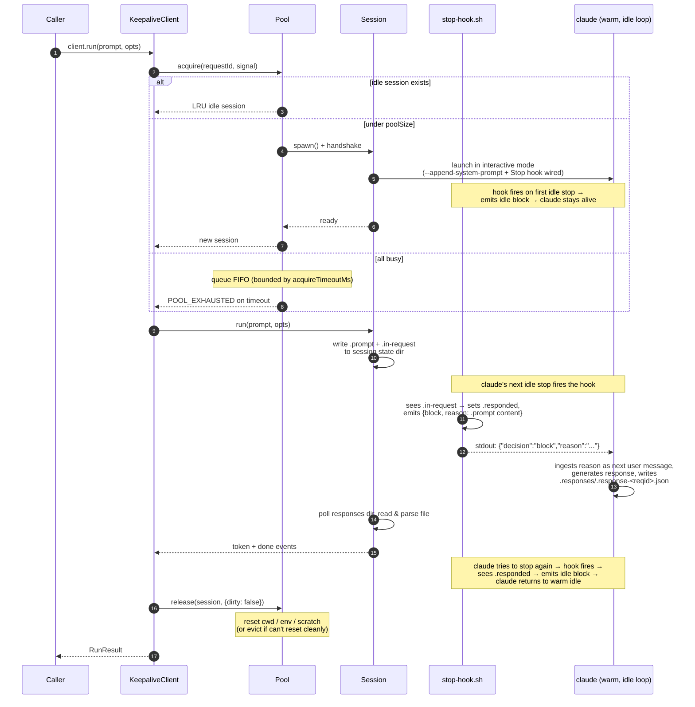
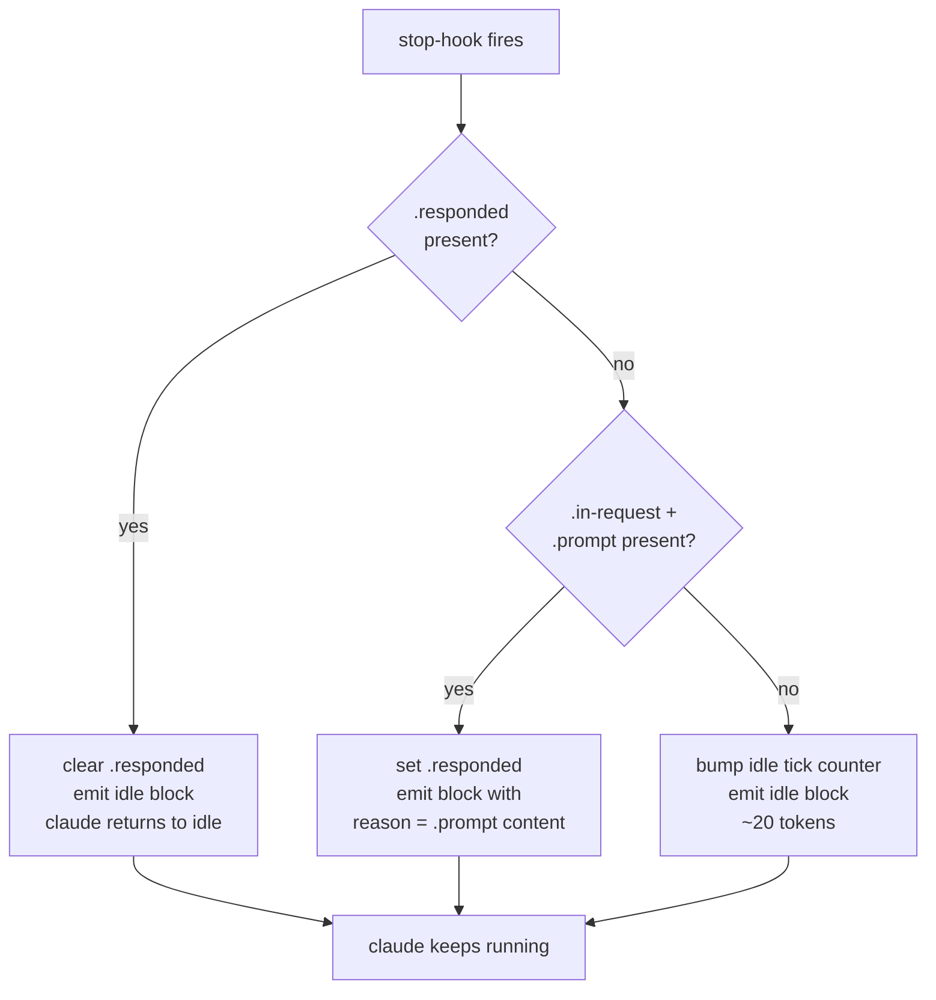

# claude-keepalive

> A drop-in replacement for `claude -p` that eliminates cold-start by reusing warm `claude` processes — without leaking state across requests.

[日本語版 README はこちら / Japanese README](./README-JP.md)

`claude -p "..."` pays the full process-startup cost on every invocation (~5–10 s on a modern Mac). For a task runner that calls Claude hundreds of times an hour, that cold-start dominates wall-clock time.

`claude-keepalive` keeps a small pool of `claude` processes warm in interactive mode and routes each request to one of them via the stop-hook injection channel — same surface as `claude -p`, isolation guarantees preserved per-request, cold-start paid only once per warm session instead of once per request.

---

## Status

**v0.x — early development.** The interactive warm-keepalive path is wired end-to-end and verified against a real `claude` CLI (`pnpm smoke:warm`: ~12 s cold, ~7 s warm on the same session). The fresh-conversation contract (invariant #1) is enforced via a system-prompt directive and a bounded `maxRequestsPerSession`, with `pnpm smoke:leakage` and `test/e2e/warm.test.ts` as regression gates. Three-layer test setup (unit / integration / e2e) is live; `pnpm test` runs unit + integration cheaply, `RUN_E2E=1 pnpm test:e2e` exercises the real-`claude` layer. Remaining work — `.ready` handshake, `mode: 'print'` wiring — is tracked in `TODO.md`.

---

## How it works

`claude` in interactive mode exits when it produces a "stop" response. The **stop hook** can block that stop by writing a structured JSON line to stdout:

```json
{"decision":"block","reason":"<text that becomes the next user message>"}
```

When claude sees this, it does *not* stop. Instead it ingests `reason` as the next user message and produces another response. So the stop hook is **the channel through which the session driver injects both idle keepalive ticks and real user prompts** — no stdin injection happens at any point.

We exploit this to keep one warm process per pool slot:

- When the pool has no work, the hook emits a tiny idle sentinel (~20 tokens) and claude returns to idle.
- When a request arrives, the session driver writes the prompt to a flag file. The next stop-hook fire reads that file and emits it as `reason`. The agent runs the turn and writes its reply to a per-request file under `.responses/`, per a contract injected at spawn via `--append-system-prompt`.
- The framing layer polls the response file, parses it, and yields the result to the caller.

### Architecture (three layers)

```
┌──────────────────────────────────────────────────────────────────────────┐
│                                                                          │
│   caller ──run(prompt, opts)──▶  ┌────────┐                              │
│                                  │  Pool  │  picks a warm session        │
│                                  └───┬────┘                              │
│                                      │ acquire                           │
│                                      ▼                                   │
│                              ┌──────────────┐                            │
│                              │   Session    │  one warm `claude` process │
│                              └──────┬───────┘                            │
│                                     │ (file-based protocol via the       │
│                                     │  per-session state dir; no stdin)  │
│                                     ▼                                    │
│                              ┌──────────────┐                            │
│                              │   claude     │  interactive mode, kept    │
│                              │              │  alive by blocking Stop    │
│                              │              │  hook                      │
│                              └──────────────┘                            │
│                                                                          │
└──────────────────────────────────────────────────────────────────────────┘
```

| Layer       | Owns                                              | Doesn't know about              |
| ----------- | ------------------------------------------------- | ------------------------------- |
| **api**     | public request/response contract                  | pool internals, process spawn   |
| **pool**    | session selection, eviction, sizing, isolation    | prompt content, stream framing  |
| **session** | one warm `claude` process + the stop-hook trick   | other sessions, request routing |

### Per-session state directory

Each warm session owns one directory under `runtime/sessions/<session-id>/`:

```
runtime/sessions/<session-id>/
  .claude/settings.json     wires the Stop hook to ./stop-hook.sh
  stop-hook.sh              the bash script claude calls on each Stop
  .prompt                   present = real prompt queued for next inject
  .in-request               flag: a real prompt is in flight
  .responded                flag: prev hook fire just injected a real prompt
  .responses/               agent writes replies here, one file per request
    .response-<requestId>.json
  .last-tick                epoch ms of most recent idle hook fire
```

This dir IS the protocol between the driver and the running claude. The driver never writes to claude's stdin after spawn.

### Request flow



### Stop-hook decision tree

The hook is a small bash script. Every fire it must emit exactly one block JSON line (otherwise claude would stop). The branch:



Every path emits `{decision:"block", ...}`. The process exits only when the pool evicts it (SIGTERM).

### Why TTY is *not* required

A naive smoke (`claude --dangerously-skip-permissions "..." < /dev/null > out.txt`) exits in ~10 s, which suggests claude requires a real pty. That's **only true when no Stop hook is configured**. The actual rule observed empirically:

| stdio          | Stop hook in `.claude/settings.json`? | behavior                              |
| -------------- | ------------------------------------- | ------------------------------------- |
| non-TTY        | no                                    | runs prompt, exits (`-p`-equivalent)  |
| non-TTY        | **yes, blocking**                     | **stays in idle loop, hook fires**    |
| TTY            | either                                | stays in idle loop                    |

The library writes a per-session `.claude/settings.json` and launches claude with `cwd = <sessionDir>`, so claude reads our hook config. This is why `WarmSession` works with plain `stdio: ['pipe','pipe','pipe']` — `node-pty` is *not* a required dependency. Verified by `pnpm smoke:warm`.

---

## Installation

```bash
pnpm add claude-keepalive
```

The package requires Node.js ≥ 22 and the `claude` CLI on `$PATH`.

---

## Usage

### Synchronous-style

```ts
import { createClient } from 'claude-keepalive';

const client = createClient({
  poolSize: 4,
  defaultTimeoutMs: 5 * 60_000,
});

const result = await client.run('Summarize the diff at HEAD~1..HEAD', {
  cwd: '/path/to/repo',
  allowedTools: ['Read', 'Bash'],
  requestId: 'task-1234',
});

console.log(result.text);

process.on('SIGTERM', () => client.close());
```

### Streaming

```ts
for await (const ev of client.runStream(prompt, opts)) {
  switch (ev.type) {
    case 'token': process.stdout.write(ev.text); break;
    case 'done':  return ev.result;
    case 'error': throw new Error(`${ev.error.code}: ${ev.error.message}`);
  }
}
```

Granularity of `token` events differs by mode (see table below).

### Modes: interactive vs print

The two modes have different execution paths and capability trade-offs:

| Mode                    | Execution                                             | `token` events                            | Use when                                       |
| ----------------------- | ----------------------------------------------------- | ----------------------------------------- | ---------------------------------------------- |
| `interactive` (default) | warm pool; same `claude` process serves many requests | one event with full text, then `done`     | task runners replacing `claude -p`; default    |
| `print` (opt-in)        | fresh `claude -p` per request; no warmth              | many events as tokens arrive, then `done` | UIs that need live token-level streams         |

```ts
const client = createClient({ poolSize: 4 });                  // interactive (default)
const client = createClient({ poolSize: 4, mode: 'print' });   // one-shot per request, true streaming
```

Setting `mode: 'print'` is opt-in and must be passed explicitly — the warm pool, idle-tick behavior, and `RunStreamEvent` granularity all differ, so a silent fallback would change semantics consumer code depends on.

### Migration from `claude -p`

| `claude -p`                              | `claude-keepalive`                          |
| ---------------------------------------- | ------------------------------------------- |
| `claude -p "hello"`                      | `await client.run('hello')`                 |
| `claude -p --output-format stream-json`  | `for await (...) of client.runStream(...)` (use `mode: 'print'` for token-level) |
| `--cwd /repo`                            | `run(prompt, { cwd: '/repo' })`             |
| `--allowedTools Read,Edit`               | `run(prompt, { allowedTools: [...] })`      |
| `--model sonnet`                         | `run(prompt, { model: 'sonnet' })`          |
| `^C` (process kill)                      | `controller.abort()` via `signal`           |

---

## Public API (v1, frozen at v1.0)

```ts
interface KeepaliveClient {
  run(prompt: string, opts?: RunOptions): Promise<RunResult>;
  runStream(prompt: string, opts?: RunOptions): AsyncIterable<RunStreamEvent>;
  close(): Promise<void>;
  on<E>(event: E, listener): this;
  off<E>(event: E, listener): this;
}

interface ClientOptions {
  poolSize?: number;
  /**
   * 'interactive' (default) keeps warm claude processes and serves many
   * requests from the same session. 'print' spawns `claude -p` per request
   * and gives token-level streaming but no warmth. Must be set explicitly —
   * never falls back silently because event granularity differs.
   */
  mode?: 'interactive' | 'print';
  maxRequestsPerSession?: number;
  maxSessionAgeMs?: number;
  maxIdleMs?: number;
  acquireTimeoutMs?: number;
  spawnTimeoutMs?: number;
  defaultTimeoutMs?: number;
  runtimeDir?: string;
  claudeBinary?: string;
}

interface RunOptions {
  signal?: AbortSignal;
  cwd?: string;
  env?: Record<string, string>;
  allowedTools?: string[];
  model?: string;
  timeoutMs?: number;
  requestId?: string;
}

interface RunResult {
  requestId: string;
  text: string;
  usage: { inputTokens: number; outputTokens: number };
  durationMs: number;
  sessionId: string;
}
```

### Error codes

`run()` rejects with a `KeepaliveError` carrying one of:

- `TIMEOUT` — exceeded `RunOptions.timeoutMs`
- `ABORTED` — `signal` aborted
- `POOL_EXHAUSTED` — no session available within `acquireTimeoutMs`
- `SESSION_CRASHED` — warm session died mid-request
- `CLAUDE_ERROR` — claude reported an error
- `INVALID_OPTIONS` — option validation failed

Consumers route on `code`, not on `message`.

---

## Invariants

These rules exist to protect the product's value proposition. Violating any of them turns "fast" into "fast and unsafe" — worse than slow-and-safe (= the `claude -p` users are leaving behind).

1. **Process-warm, not conversation-warm.** Every request starts a fresh conversation. No reuse of history across requests.
2. **No cross-request state leaks.** `cwd`, env vars, scratch files, conversation history — all reset between requests on the same session.
3. **The public API is the product.** Frozen at v1.0; new capabilities arrive as new methods or opt-in fields.
4. **Pool decisions are local; sessions are dumb.** Routing lives in the pool.
5. **Every wait is bounded.** No `await` without a timeout.
6. **Per-request abort works.** `AbortSignal` cancels the request and cleans the session.
7. **Failure isolation.** A crashed session takes down at most itself.
8. **Observability is mandatory.** Spawn, recycle, eviction, timeout, crash → structured log + counter.
9. **Interactive mode is the default; `print` is opt-in.** Default warm sessions run `claude` interactively and serve many requests off the same process. `mode: 'print'` spawns a fresh `claude -p` per request and emits per-token stream events — but must be set explicitly because the warm-pool semantics and event granularity differ. Falling back to `claude -p` without the consumer asking changes behavior consumer code couples to.

---

## Pool sizing

| Workload                                 | Recommended `poolSize`     |
| ---------------------------------------- | -------------------------- |
| Single-user chat bot                     | 1–2                        |
| Task-runner platform (N parallel tasks)  | N + small headroom         |
| Latency-sensitive request/response       | ≥ p99 concurrency          |
| Batch / one-off                          | Use `claude -p` directly   |

Below ~1 request/min/session, keepalive's idle-tick token cost roughly equals the cold-start savings — use `claude -p` instead.

---

## Project layout

```
src/
  api/                public surface (types, errors, client)
  pool/               session selection, eviction, FIFO acquire queue
  session/
    index.ts          Session interface
    warm-session.ts   production Session backed by a real claude process
    framing.ts        file-based prompt-in / response-out transport
    hook.ts           the stop-hook bash script (renderer)
    spawn.ts          spawn + handshake + hook script install
    idle.ts           idle-tick aggregation
    paths.ts          per-session state dir layout
  core/
    clock.ts          Clock + Sleeper (injectable for tests)
    proc.ts           ProcessLauncher (injectable)
    random.ts         session id / request id generation
  index.ts            createClient

test/
  helpers/            FakeClaude, test clock, test pool factory
  unit/               pool reuse / isolation / eviction / crash
```

---

## Development

```bash
pnpm install
pnpm typecheck     # tsc --noEmit
pnpm test          # vitest run
pnpm check         # biome format + lint + organize imports
pnpm build         # emit dist/
pnpm smoke:warm    # e2e against real `claude` (warm interactive path; ~30 s, uses API quota)
pnpm smoke         # e2e against real `claude` (one-shot print path; ~15 s, uses API quota)
```

Test layering:

- `test/unit/` — < 50 ms each, no real process, no real fs
- `test/integration/` — planned: < 2 s each, real tmpdir, fake `claude` binary
- `test/e2e/` — planned: < 30 s each, real `claude` binary, smoke only. Today: `scripts/warm-smoke.mjs` (real round-trip; ~12 s cold, ~7 s warm)

Coverage gates: 85% lines on `src/api`, `src/pool`, `src/session`, `src/core`; 100% branch on `src/session/hook.ts`.

---

## License

Apache-2.0
